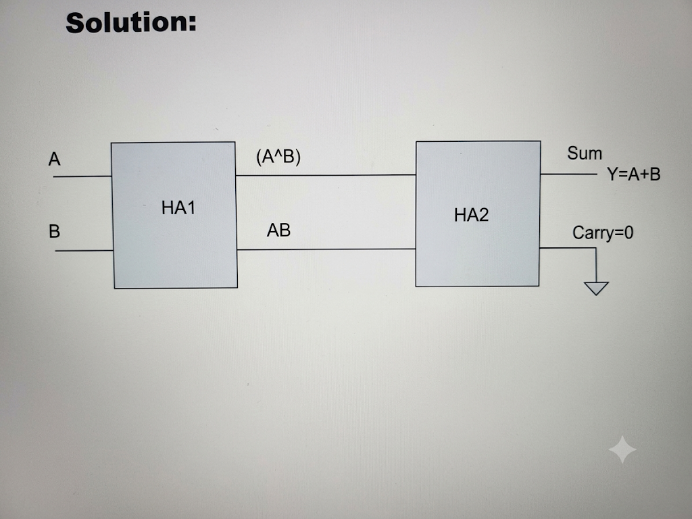
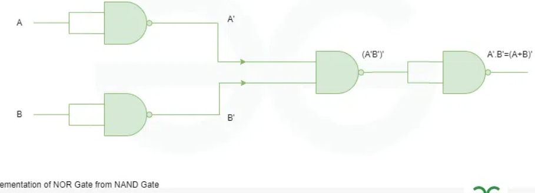
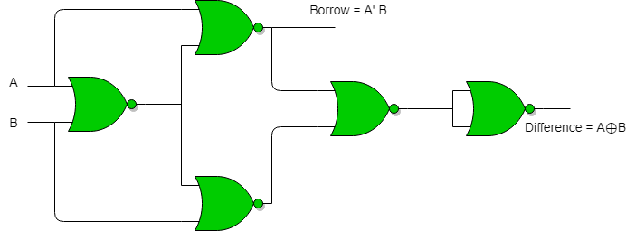

---
tags:
  - Digital-Electronics
title: "TRICK QUESITIONS WITH TECHNIQUES"
---

# TRICK QUESITIONS WITH TECHNIQUES

??? note "OR GATE using HA"

    { loading=lazy }

??? note "NOR using NAND"

    { loading=lazy }

??? note "Half Subtractor using nor gate"

    { loading=lazy }

??? note "RADIX conversion from radix (n! =10) to radix (n! = 10) or (153)12=(X)8+(32)5"

    Convert TO radix 10 then required radix

??? note "Propagation Delay formula"

    Basic formula

    $$\boxed{t_{pd} = t_{output} - t_{input}}
    $$

    For a logic gate, we commonly have two delays:

    $$\boxed{t_{pLH}}
    $$

    Delay when output changes **Low → High**

    and

    $$\boxed{t_{pHL}}
    $$

    Delay when output changes **High → Low**.

    Average propagation delay

    $$\boxed{t_{pd} = \frac{t_{pLH} + t_{pHL}}{2}}
    $$
