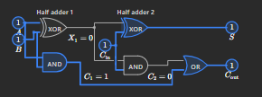
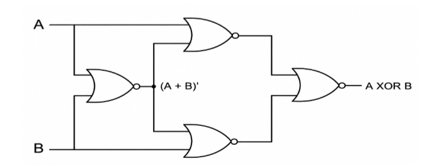
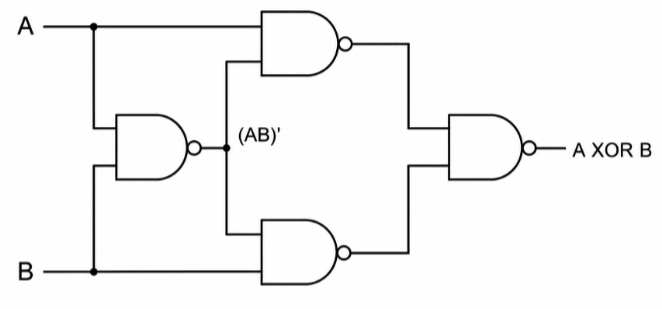

---
tags:
  - Digital-Electronics
---

# NOTES Combinational

## Half and Full Adder

Sum = A ^ B

Carry = A & B

Sum = A ^ B ^ Cin

Cout = (A & B) \| (B & Cin) \| (A & Cin)

Cout​=AB + Cin​(A^B)

{ loading=lazy }

## Half and Full Subtractor

Half Subtractor:  
D = A ⊕ B  
Bout = A̅B

Full Subtractor:  
D = A ⊕ B ⊕ Bin  
Bout = A̅B + A̅Bin + BBin

Equivalent form:  
Bout = A̅B + Bin(A ⊙ B)

## Full Adder using MUX

## How many full adders and half adders are required to design an m-bit adder?

$${\boxed{\text{Half~Adders} = 1}
}\boxed{\text{Full~Adders} = m - 1}$$

This is for RPA, without cin, if cin the m FA are required

## How many JK flip-flops are required to implement a 3-decade BCD counter?

A BCD decade = **4 FFs**, so a 3-decade BCD counter = **3 × 4 = 12 FFs**.

Note that although 4 FFs provide 16 possible binary states, states **1010–1111 (10–15)** are unused in a BCD counter.

## How many 4:1 MUX req to build 512:1 Mux

**General shortcut:**

For $4^{n}:1$MUX:

$$\frac{N - 1}{4 - 1}
$$

For 512:

$$\frac{512 - 1}{3} = 170.33$$

$$\boxed{170\text{~×~4:1~MUXes} + 1\text{~×~2:1~MUX}}
$$

If you are asked **only for 4:1 MUXes**, the answer is **170**, but you need one 2:1 MUX to get the final output.

## How many OR GATES to implement DECIMAL TO BCD Encoder

For a **Decimal-to-BCD encoder**, there are:

- **10 inputs**: $D_{0}$to $D_{9}$

- **4 outputs**: $Y_{3},Y_{2},Y_{1},Y_{0}$

The output equations are:

$${Y_{3} = D_{8} + D_{9}
}{Y_{2} = D_{4} + D_{5} + D_{6} + D_{7}
}{Y_{1} = D_{2} + D_{3} + D_{6} + D_{7}
}{Y_{0} = D_{1} + D_{3} + D_{5} + D_{7} + D_{9}
}$$

If **multi-input OR gates are allowed**, you need:

$$\boxed{4\text{~OR~gates}}
$$**If only 2-input OR gates are allowed**

**11 or gates**

## Anti coincidence – xor gate

## Coincidence – xnor gate

## If the address bus = 30 bits, then the number of unique addresses is:

$$2^{30}
$$

Assuming **each address points to 1 byte**:

$${\text{Memory~size} = 2^{30}\text{~bytes}
}{= \boxed{1\text{~GB}}
}$$Answer: 1 GB

## CLA – Carry Look Ahead Adder

**Carry Look-Ahead Adder (CLA)**

For bit position i:

Generate:  
Gᵢ = AᵢBᵢ

Propagate:  
Pᵢ = Aᵢ ⊕ Bᵢ

Carry:  
Cᵢ₊₁ = Gᵢ + PᵢCᵢ

Sum:  
Sᵢ = Pᵢ ⊕ Cᵢ

**4-bit CLA**

C₁ = G₀ + P₀C₀

C₂ = G₁ + P₁G₀ + P₁P₀C₀

C₃ = G₂ + P₂G₁ + P₂P₁G₀ + P₂P₁P₀C₀

C₄ = G₃ + P₃G₂ + P₃P₂G₁ + P₃P₂P₁G₀ + P₃P₂P₁P₀C₀

Sum equations:

S₀ = P₀ ⊕ C₀

S₁ = P₁ ⊕ C₁

S₂ = P₂ ⊕ C₂

S₃ = P₃ ⊕ C₃

## CSKA – Carry Skip Adder and CSA – Carry Save Adder

## BCD ADDITION

> **Rule for BCD addition**

1.  Add the two 4-bit BCD digits using normal binary addition.

2.  If the result is **greater than 9 (1001)** OR there is a **carry out**, add **0110 (decimal 6)**.

3.  The resulting 4 bits are the valid BCD digit, and any carry goes to the next decimal digit.

## X0R USING NAND, XNOR USING NOR

{ loading=lazy } a xnor b

{ loading=lazy }

## AND, OR, NOT, XOR, NAND, NOR, XNOR USING 2:1 MUX
