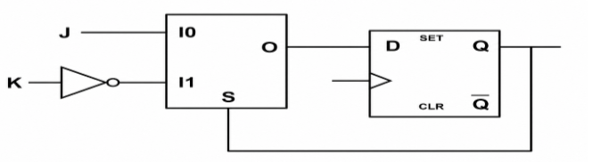

---
tags:
  - Digital-Electronics
---

# NOTES SEQ

## FF Conversion -> FF to FF

Required Info =\> Truth table of req FF, excitation or available FF, next state or characteristic equation , minimization of equation.

| **Conversion** | **Input equations**             |
|----------------|---------------------------------|
| **D → JK**     | $$D = J\bar{Q} + \bar{K}Q$$     |
| **D → T**      | $$D = T\oplus_{}^{}Q$$          |
| **D → SR**     | $$D = S + \bar{R}Q$$            |
| **JK → D**     | $$J = D,\text{~}K = \bar{D}$$   |
| **JK → T**     | $$J = K = T$$                   |
| **JK → SR**    | $J = S,\text{~}K = R$\*         |
| **T → D**      | $$T = D\oplus_{}^{}Q$$          |
| **T → JK**     | $$T = J\bar{Q} + KQ$$           |
| **T → SR**     | $$T = S\bar{Q} + RQ$$           |
| **SR → D**     | $$S = D,\text{~}R = \bar{D}$$   |
| **SR → JK**    | $$S = J\bar{Q},\text{~}R = KQ$$ |

\*Assuming the SR input combination $S = R = 1$is not used.

## JK USING DFF , 2:1 MUX AND INVERTOR

{ loading=lazy }

## Design a d flipflop and d latch using mux

1.  **1. D Latch using 2:1 MUX**

A D latch has an **Enable (EN)**.

Behavior:

- EN = 1 → $Q = D$

- EN = 0 → $Q$**holds its previous value**

Use a **2:1 MUX with feedback**:

┌──────────────┐

D ──────►│ 0 Y ├────► Q

│ │

Q ──────►│ 1 2:1 │

│ MUX │

EN ─────►│ Select │

└──────────────┘

D

MASTER LATCH SLAVE LATCH

D ───────► \[ D LATCH \] ───────► \[ D LATCH \] ─────► Q

EN = CLK EN = ~CLK
